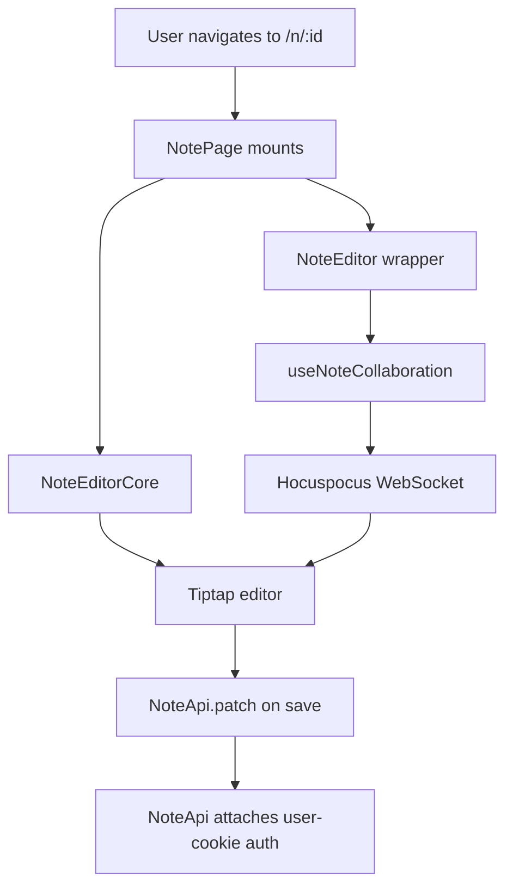

# NoteEditor (private)

The editor mounted for a logged-in user on `/n/:id`. Renders the same
`NoteEditorCore` UI as the public editor, but the JWT + Hocuspocus
session come from the user's session cookies, not from a share grant.

## Flow

1. `NotePage` resolves the `:id` param and fetches the note via `useNote`.
2. `NoteEditor` (in `Editor.tsx`) calls `useNoteCollaboration(noteId)` — this hook only opens the Hocuspocus WebSocket when `editMode` is true.
3. The Y.Doc and provider from step 2 (or empty/doc + dummy provider in read mode) are forwarded to the collab-agnostic `NoteEditorCore`.
4. `NoteEditorCore` binds a Tiptap editor via the `Collaboration` extension to the supplied Y.Doc.
5. Saving calls `useActiveNoteStore.save(...)` → `useUpdateNote` → `NoteApi.patch(...)`; auth is the user-cookie path because `Bootstrap` uninstalls the share-token provider when a user is logged in and the route is not `/public/*`.

## Behaviour

- **Read mode (default)**: empty Y.Doc, no Hocuspocus socket. `useEffect` in `NoteEditorCore` loads the note's markdown into the empty doc once, the editor renders it read-only.
- **Write mode**: Hocuspocus WebSocket opens with `token: () => useAuthStore.getState().accessToken ?? ""`; updates sync both ways. The collab badge reflects the connection state.
- **Toggle**: `NoteButtonActionRow` flips `useEditorSettings.editMode`. Toggling from write → read disconnects the provider; toggling back reconnects it.
- **Save**: persists title + content via `NoteApi.patch`, refreshes note + activity caches on success.

## Auth

| Source | Path |
|---|---|
| User JWT | `useAuthStore.accessToken`, refreshed by `useAccessToken` |
| Note API | `credentials: "include"` + cookie session; share provider is uninstalled off `/public/*` |
| Hocuspocus | `token` callback reads `useAuthStore.getState().accessToken` lazily |
