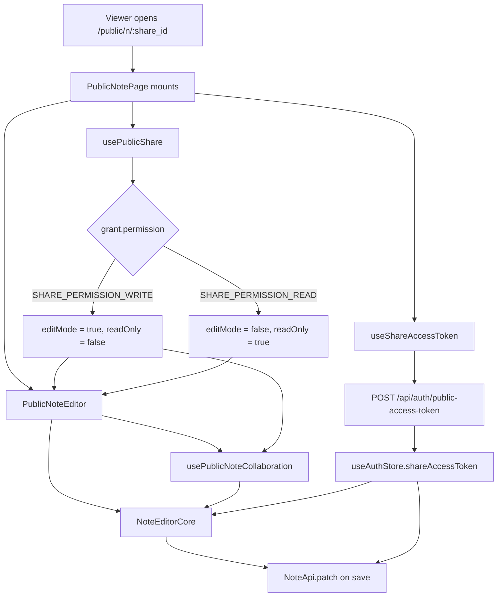

# PublicNoteEditor

The editor mounted on `/public/n/:share_id` for viewers of a shared note.
Reuses `NoteEditorCore`; only the auth source and the live-collab hook
differ from the private editor.

## Flow

1. `PublicNotePage` reads `:share_id` from the URL and calls `usePublicShare({ share_id })`. The grant returns `note_id` and `permission`.
2. `permission === "SHARE_PERMISSION_WRITE"` lifts `editMode`; otherwise the editor is pinned read-only and `viewConfig.readOnly = true`.
3. `useShareAccessToken({ shareId })` posts to `/api/auth/public-access-token` to obtain the share JWT and writes it into `useAuthStore.shareAccessToken`. It self-reschedules a refresh just before the JWT's `exp`.
4. With the token in the store, `Bootstrap` (route-aware on `/public/*`) installs the share-token provider on every API that extends `ShareTokenBearer`.
5. `PublicNoteEditor` is fed into `NoteEditorCore` exactly like the private editor; the only difference is the live-collab hook (`usePublicNoteCollaboration`) and the (disabled) toggle in the action row.
6. Saving still goes through `NoteApi.patch`, but the share provider is now installed, so the `Authorization: Bearer <share-jwt>` header is attached automatically.

## Behaviour matrix

| `permission` | `editMode` | `viewConfig.readOnly` | Toolbar | Hocuspocus |
|---|---|---|---|---|
| `SHARE_PERMISSION_WRITE` | `true` | `false` | toggle + save visible | opened via `usePublicNoteCollaboration` |
| `SHARE_PERMISSION_READ` (and anything else) | `false` | `true` | toggle + save hidden, share button stays | never opened, empty Y.Doc + dummy provider |

## Auth

| Source | Path |
|---|---|
| Share JWT | `useAuthStore.shareAccessToken`, owned by `useShareAccessToken` |
| Note API | `ShareTokenBearerMixin` on `NoteApi` attaches `Authorization: Bearer <share-jwt>`; user cookies are intentionally ignored on `/public/*` |
| Hocuspocus | `usePublicNoteCollaboration` reads `useAuthStore.shareAccessToken` for the WebSocket handshake |

## Cleanup

On `PublicNotePage` unmount we:

1. Reset `viewConfig` and set `editMode = false`.
2. Clear `useAuthStore.shareAccessToken` so navigating back to `/n/*` doesn't leak the grant.
3. `getPublicCollabEntry(noteId)?.provider.disconnect()` to close the Hocuspocus socket immediately rather than waiting for its idle timeout.
